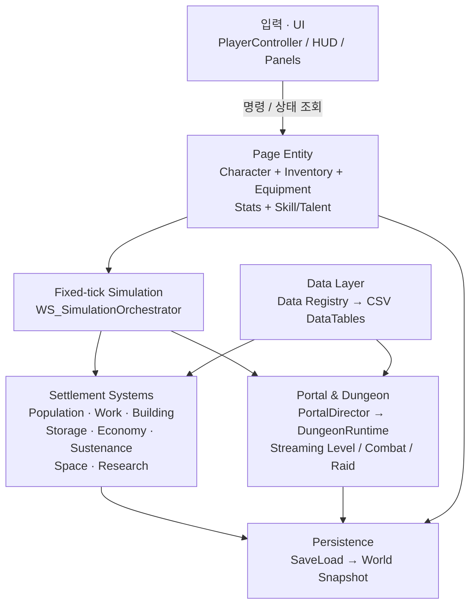
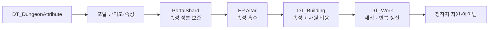

# AEidos

> **Unreal Engine 5 기반 정착지 경영 · 던전 원정 시뮬레이션 프로토타입**

`AEidos`는 플레이어가 **Page**를 직접 조작해 정착지를 운영하고, 주기적으로 생성되는 포탈을 통해 던전형 적대 정착지를 탐험하는 싱글플레이 게임 프로젝트입니다.

정착지에서 모은 인력과 시설로 원정을 준비하고, 던전 코어를 파괴한 뒤 붕괴 제한 시간 안에 자원과 포탈 조각을 반출합니다. 반출한 조각은 제단에서 속성 자원으로 흡수되어 연구와 영구 생산 시설 건설에 사용됩니다.

> 현재는 핵심 게임 루프와 시스템 구조를 구현·검증하는 단계입니다. 콘텐츠 아트, 전투 액션 확장, 생산 체인의 완성도는 진행 중입니다.

---

## 핵심 플레이 루프


### 던전 원정 규칙

- 포탈은 정착지 가치에 따라 난이도와 여러 속성 성분을 갖고 생성됩니다.
- 코어 파괴 시 원정 Page의 인벤토리에 해당 속성 성분을 보존한 `PortalShard`가 지급됩니다.
- 코어 위치에는 귀환 포탈이 생성되며, 실제 시간 기준 붕괴 제한 시간이 시작됩니다.
- 제한 시간 내 귀환하지 못한 Page와 인벤토리는 던전과 함께 소멸합니다.
- 일반 던전 보상은 자동 지급되지 않습니다. 필요한 자원은 던전에서 직접 수집·반출해야 합니다.
- 창고에 보관한 조각은 `EP Altar`에 헌납하여 속성 자원으로 전환할 수 있으며, 속성 자원은 건물과 연구의 비용으로 소비됩니다.

---

## 구현된 시스템

| 영역 | 현재 구현 범위 |
|---|---|
| 정착지 | 영토 확장, 건물 프리뷰·건설 작업, 건물 수용력, 자동 작업 등록 |
| Page | 선택·전환, 인벤토리, 장비, 무게/부피, 과적 이동 패널티, 스킬·재능 |
| 작업 | Work Request → Work Instance → Page 배정, 공유 진행도, 수동 중단 후 재개 |
| 월드 상호작용 | 블록 기반 수확·줍기·설치, 도구 태그 판정, 좌클릭 준비 행동과 우클릭 메뉴 |
| 포탈·던전 | 포탈 생성, 난이도·속성 생성, 원정대 편성, 스트리밍 던전, 프리셋 복원, 코어·귀환·붕괴 |
| 전투 | 조우 감지, 턴 순서, 행동력 소비, 타겟 선택, 기초 스킬, 적 턴, 가사·사망 처리 |
| 인구 | Page 수용력, 수감, 포섭 작업, 수동 구조, 원정대 제외 규칙 |
| 데이터 | CSV DataTable 기반 Item / Work / Building / Research / Portal / Dungeon Attribute 정의 |
| 저장 | 주요 정착지·작업·인구·연구·포탈·아이템·던전 런타임 상태의 Snapshot 저장/복원 구조 |

### 진행 중인 범위

- 전투 스킬, 상태 이상, 적 AI의 확장
- 제작·생산 체인의 전체 콘텐츠화와 밸런싱
- 연구 UI 및 작업 게이팅의 고도화
- 드롭 가능한 아이템의 월드 픽업 콘텐츠 확장
- 세이브/로드 전 범위 검증
- Page 외형 커스터마이징과 그래픽 리소스 파이프라인

---

## 아키텍처



### 설계 원칙

- **UI는 규칙을 소유하지 않습니다.** 선택 Page와 World Subsystem의 인터페이스를 통해 명령하고 상태를 표시합니다.
- **Page는 개체 고유 상태를 가집니다.** 인벤토리, 장비, 스탯, 스킬, 재능은 `APageCharacter` 및 컴포넌트가 보유합니다.
- **월드 규칙은 고정 틱으로 처리합니다.** 실시간 정착지 시스템과 Page 단위 턴제 전투가 동시에 존재할 수 있도록 시뮬레이션 책임을 분리했습니다.
- **콘텐츠 규칙은 DataTable로 정의합니다.** 건물, 작업, 아이템, 연구, 던전 속성은 코드 하드코딩 대신 CSV DataTable에서 연결합니다.
- **런타임 상태는 Snapshot으로 복원합니다.** 포탈, 작업 인스턴스, 인구, 저장 아이템 등 지속되어야 할 상태를 저장 참여 시스템이 기록합니다.

---

## 포탈 속성 · 조각 · 생산 해금



던전은 하나의 테마가 아니라 여러 속성의 조합으로 생성됩니다. 속성별 난이도 가중치와 성분 강도의 합이 던전 난이도를 구성하며, 고등 자원 속성은 높은 난이도에서만 후보가 됩니다.

---

## 프로젝트 구조

```text
Source/AEidos/
├─ Combat/                 # 턴제 조우 및 전투 진행
├─ Core/                   # 공통 타입, 이벤트, 인터페이스
├─ Data/                   # Data Registry와 DataTable Row 정의
├─ Entities/
│  ├─ Page/                # Page Character, 스탯·스킬 컴포넌트
│  ├─ Items/               # 인벤토리·장비·아이템 인스턴스
│  └─ Building/            # 생산 컴포넌트
├─ Save/                   # Snapshot 스키마와 Save/Load
├─ Simulation/             # 고정 틱 오케스트레이터와 Command Buffer
├─ UI/                     # HUD, 패널, 월드 상호작용 UI
└─ World/
   ├─ Dungeon/             # 스트리밍 던전, 코어, 귀환 포탈, 프리셋
   └─ Settlement/          # 인구·작업·건설·창고·포탈 등 World Subsystem

Docs/
└─ DataTableSeeds/Current/ # 현재 DataTable의 편집 가능한 CSV 원본

Scripts/
└─ reimport_current_datatables.py  # Current CSV 일괄 Reimport 보조 스크립트
```

---

## 데이터 주도 콘텐츠

현재 편집 기준 CSV는 [`Docs/DataTableSeeds/Current`](Docs/DataTableSeeds/Current/README.md) 폴더입니다.

| 테이블 | 역할 |
|---|---|
| `DT_Resource` | 정착지 원자재 및 속성 자원 |
| `DT_Item` | 아이템, 장비 슬롯, 도구 태그, 인벤토리 행동 |
| `DT_Work` | 비용, 보상, 작업량, 필요 시설·스킬 |
| `DT_Building` | 배치, 건설 작업, 수용력, 자동 작업 |
| `DT_Research` | 연구 작업과 선행 연구 |
| `DT_Portal` | 포탈 생성 및 던전 프리셋 선택 |
| `DT_DungeonAttribute` | 속성 출현, 난이도 가중치, 조각 성분 |
| `DT_Block` / `DT_BlockInteraction` | 월드 블록 상태와 상호작용 |

DataTable을 수정할 때는 `Current` 폴더의 README에 있는 매핑과 재임포트 절차를 따릅니다.

---

## 시작하기

### 요구 환경

- Unreal Engine **5.6**
- Windows
- Visual Studio의 C++ 게임 개발 워크로드

### 실행

1. 저장소를 내려받습니다.
2. `AEidos.uproject`를 Unreal Engine 5.6으로 엽니다.
3. C++ 모듈 빌드가 필요하면 프로젝트 파일을 생성한 뒤 `AEidosEditor` 타깃을 빌드합니다.
4. 기본 시작 맵은 `MenuMap`입니다. 에디터에서 Play를 실행합니다.

### DataTable 재임포트

CSV를 변경한 뒤에는 Unreal Editor에서 해당 DataTable을 개별 Reimport하거나, 프로젝트의 보조 스크립트를 사용할 수 있습니다.

```text
Scripts/reimport_current_datatables.py
```

세부 매핑과 안전한 재임포트 순서는 [`Docs/DataTableSeeds/Current/README.md`](Docs/DataTableSeeds/Current/README.md)를 확인합니다.

---

## AI 개발 보조 도구 활용

이 프로젝트는 **OpenAI Codex를 개발 보조 도구로 활용**했습니다.

- 코드베이스 탐색, 구조 검토, 리팩터링 및 C++ 구현 보조
- DataTable 스키마·초기 콘텐츠 목록 검토와 CSV 작성 보조
- 게임 규칙, 기술 트리, 그래픽 리소스 제작 계획 문서화 보조
- 구현 결과와 계획서 간의 불일치 점검 보조

게임 규칙의 방향 설정, 시스템 구조 선택, 코드 통합, DataTable 선별·수치 조정, Unreal Editor 내 검증과 최종 반영은 프로젝트 작성자가 수행했습니다. AI가 생성한 제안은 검토 후 프로젝트 구조와 플레이 의도에 맞는 것만 반영했습니다.

---

## 문서

- [현재 DataTable CSV 안내](Docs/DataTableSeeds/Current/README.md)
